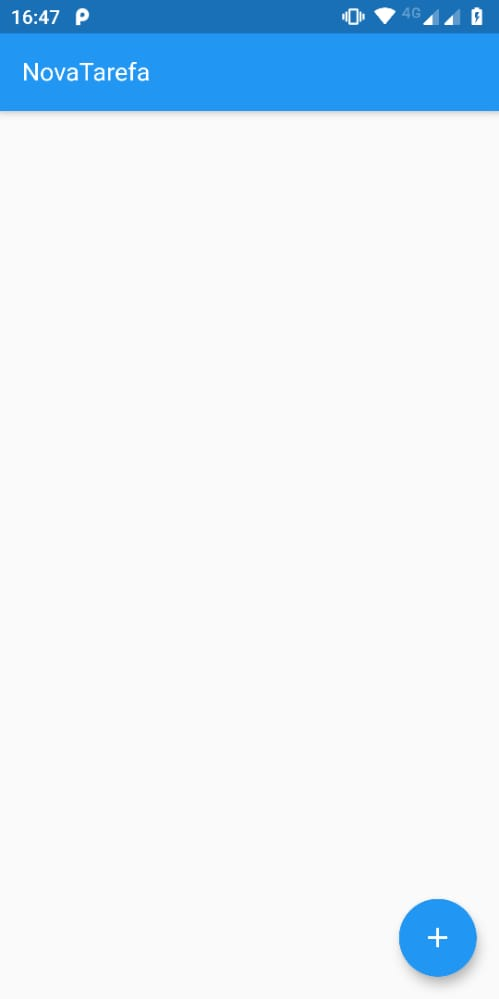
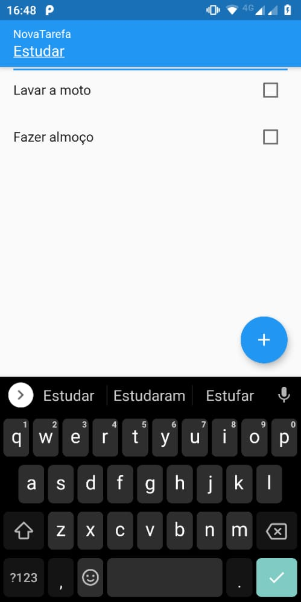
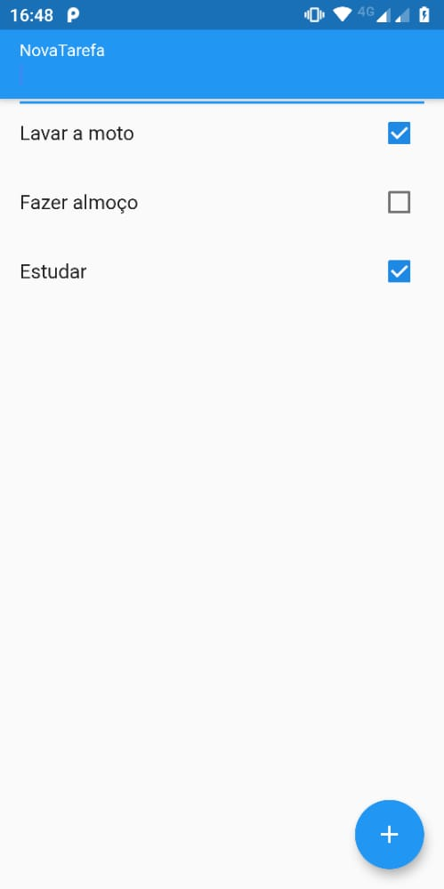
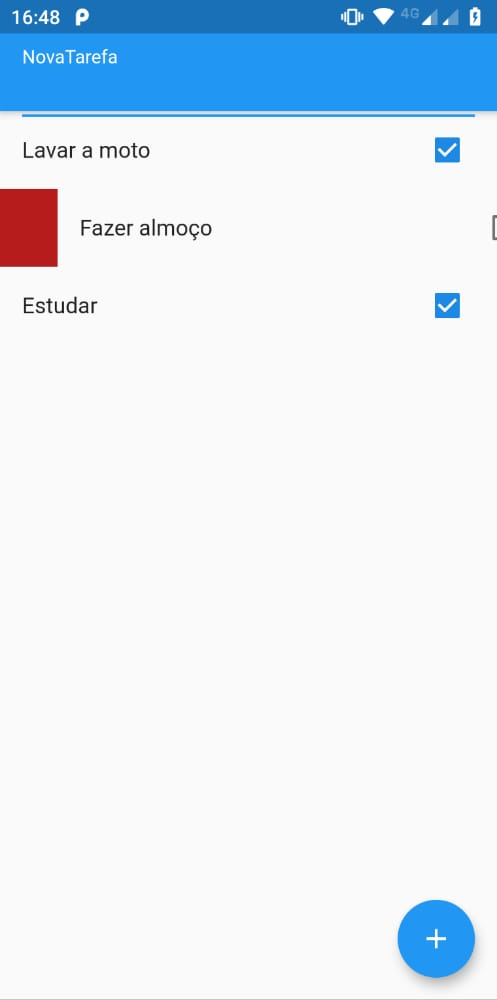

# todo_app #
Um Projeto Desenvolvido em Flutter/Dart.

## Proposta do Aplicativo ##
Desenvolver uma Lista de a Fazeres, Criando Novos Items, Removendo e Salvando o Estado da Aplicação! 

## Vamos Começar
Este projeto é o ponto de partida para um aplicativo Flutter.

## Tela Inicial do App ##

# Podemos Adicionar Novas Tarefas ##

# Marcar as Tarefas Concluídas ###

# Eliminar as Tarefas Feitas ####

## Documentação
consulte nossa documentação online (https://flutter.dev/docs), que oferece tutoriais,
amostras, orientação sobre desenvolvimento móvel e uma referência completa de API.

Desenvolvido por Dennis Weyner.
